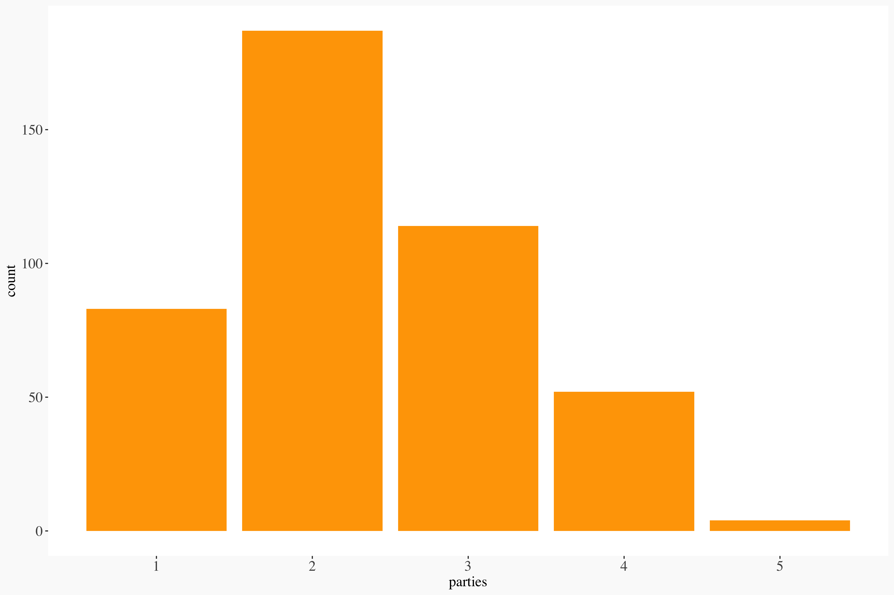

## Social Media Election Trends

(actually Twitter)

(actually about how can we measure stuff)

(actually about what do we mean talking about stuff)

**Sources:**

- 29064 politician/party tweets from the last 6 months
- 114838 replies to those tweets
- 176000 recent likes of highly active repliers
- 2687383 additional tweets mentioning polticians & parties in the last year (in additon to the last 6 months of replies).

Readable graphs: https://github.com/thoughtfulbloke/nethui2020

(code in .Rmd file)

## Sentiment of replies

Average sentiment of replies to political tweets by account replied to

The lack of difference is interesting in relation to the negativity seen when checking responses to female politicians in other countries. this graph has also gone slightly more postive since the 2017 election.

## Sentiments of replies

Sentiments per 1000 words in replies to politcal tweets

this is an example of a fairly standard sentiment graph aggregating repsonses to accounts associated with different poltical parties. The profound lack of difference across the responders is of note.

## Sentiments of party tweets showing unmatched words

But there are issues with using sentiment analysis well, or at all. If we include the number of unknown terms, the differences we were seeing (that were already insignificant) become overwhelmingly insignificant.

## Adding Synonyms and stemming

We can apply tricks to reduce the unknowns, such as using synonyms and stemming (removing the suffixes of words when matching) however what we are doing is extending the range of a limited set of lookup values.

## Most trusting Reply

This is the tweet that, by far, scores as showing the most trust:

@jamespeshaw Green school Green school Green school Green school Green school Green school Green school Green school Green school Green school Green school Green school Green school Green school Green school Green school

This is what everyone thinks when you speak

Because it is all based on a limited set of sentiment lookup matches, it has no knowledge of local context, nor does it cope with the limited character count of twitter leading people to talk about the thing, rather than using metaphors in extended discussion. 

## Ratioing by party

Replies vs likes, for every tweet made by a political account

(most extreme 2 tweets for each account removed)

Yes, NZ Twitter is mostly to the left of parties on the right, but so are most voters.

## Ratio by gender

There are no particularly dramatic differences if you look at ratioing by gender (which is in line with other indicators)

## ratio by gender 90% quartile

Taking the 10% most ratio'd tweets, there is no strong gender difference among the most engaged with tweets.

## Repliers likes of parties

Of those most replying to poltician's tweets, who liked at least one tweet from a political account, most people liked tweets associated from two or more parties. Which, again, suggests a lack of polarisation.

## liking and replying

## stalking

Of those gone from Twitter, 
percent of tweets to politicians by supposed total tweets

By dividing the number of captured tweets by the supposed number (actually undeleted number) of tweets made, you can see the range of people reponded to. And an estimate of the number of tweets being deleted. Either one may be an early indicator of an offensive/stalky account.

## non-sequiters

The percentage of words the reply has in common with the original tweet

Normal conversation has between 10% and 50% of the same words, so a reply with nothing in common suggests the reply is not to engage with the topic. These numbers could be further adjusted with synonyms etc.

